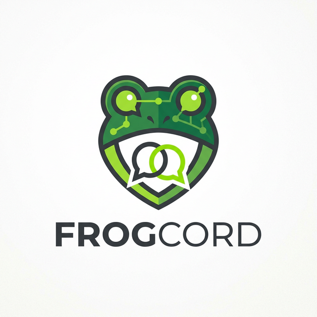
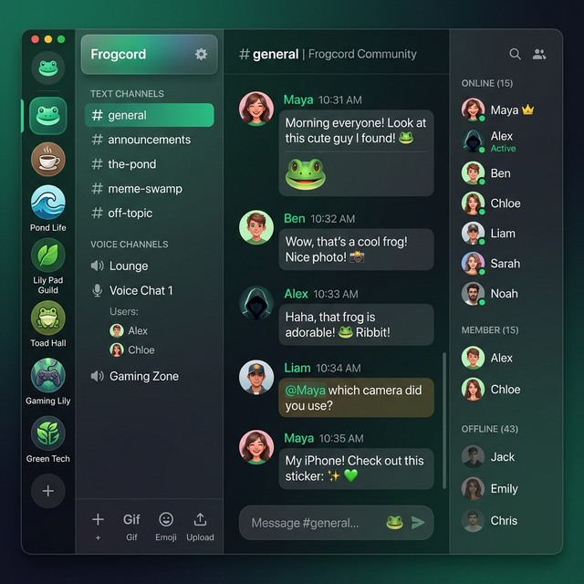

# Frogcord 🐸

<div align="center">
  
  <h3>Modern, Hızlı ve Güçlü Mesajlaşma Platformu</h3>
  <p>Discord'un esnekliği, kurbağanın zıplama hızıyla birleşti!</p>
</div>

---

**Frogcord**, modern bir mesajlaşma deneyimi sunan, Discord'dan ilham alan gelişmiş bir iletişim platformudur. Electron tabanlı masaüstü uygulaması, React destekli hızlı arayüzü ve FastAPI ile güçlendirilmiş güvenli backend yapısıyla kesintisiz bir deneyim sunar.

## ✨ Öne Çıkan Özellikler

*   🚀 **Gerçek Zamanlı İletişim:** Socket.io entegrasyonu ile milisaniyeler içinde mesajlaşma.
*   🎨 **Modern Tasarım:** Karanlık mod odaklı, göz yormayan ve premium hissettiren kullanıcı arayüzü.
*   ⚡ **Yüksek Performans:** backend tarafında FastAPI, frontend tarafında Vite ile ultra hızlı deneyim.
*   🖥️ **Masaüstü Uygulaması:** Electron sayesinde sistem tepsisi entegrasyonu ve tam ekran deneyimi.
*   🔒 **Güvenli Mimari:** JWT tabanlı kimlik doğrulama ve SQLAlchemy ile güvenli veritabanı yönetimi.

## 📸 Ekran Görüntüleri


*Modern ve kullanıcı dostu arayüz tasarımı.*

## 🛠️ Teknoloji Yığını

| Katman | Teknoloji |
| :--- | :--- |
| **Frontend** | React, Vite |
| **Backend** | FastAPI (Python), SQLAlchemy |
| **Real-time** | Socket.io (Node.js) |
| **Database** | SQLite / PostgreSQL |
| **Desktop** | Electron |
| **Styling** | Vanilla CSS / Custom Modules |

## 🚀 Başlangıç

Projeyi yerel makinenizde çalıştırmak için aşağıdaki adımları takip edin.

### 1. Gereksinimler
*   Node.js (v18+)
*   Python (3.9+)
*   npm veya yarn

### 2. Kurulum Adımları

#### Depoyu Klonlayın
```bash
git clone https://github.com/muhammeddolan-sketch/frogcord.git
cd frogcord
```

#### Backend (Core API) Hazırlığı
```bash
cd core-api
python -m venv venv
source venv/bin/activate  # Windows: venv\Scripts\activate
pip install -r requirements.txt
# API'yi başlatın
uvicorn app.main:app --reload --port 8000
```

#### Socket API Hazırlığı
```bash
cd ../socket-api
npm install
node index.js
```

#### Frontend Hazırlığı
```bash
cd ../frontend
npm install
npm run dev
```

#### Electron Uygulamasını Başlatma
```bash
# Proje kök dizininde
cd ..
npm install
npm run electron:start
```

## 📂 Proje Klasör Yapısı

*   `frontend/`: React tabanlı kullanıcı arayüzü.
*   `core-api/`: FastAPI ile yazılmış ana API servisleri.
*   `socket-api/`: Sohbet ve bildirimler için Socket.io servisi.
*   `assets/`: Logo ve ekran görüntüleri.
*   `main.js`: Electron giriş dosyası.
*   `gateway.js`: Mikroservisler arası yönlendirme.

---

<p align="center">
  Muhammed Dolan tarafından ❤️ ile geliştirildi.
</p>
